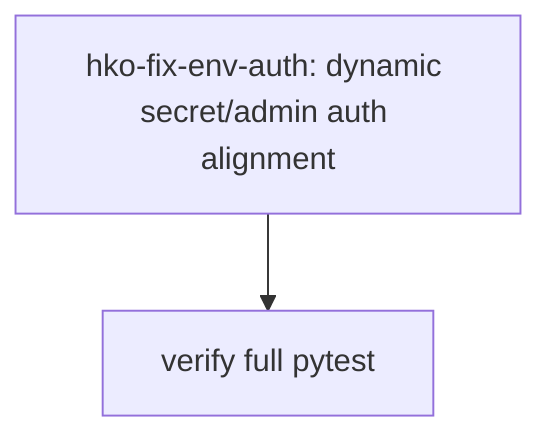

# HKO Truth Audit Report

Date: 2026-05-26

## Scope

- Target skill: `C:/Users/Administrator/.codex/skills/HKO-truth-audit/SKILL.md`
- Repo under audit: `C:/Users/Administrator/Desktop/Github/Genesis-Agents`
- Cross-repo integration check: `C:/Users/Administrator/Desktop/SwarmSync`
- Transcript: none provided; OTA ran in design-time mode with reduced execution-history confidence.

## Findings

- [HIGH] [Source: RIO] Full-suite verification initially failed because `main.py` captured `INTERNAL_SECRET` at import time while `test_conduit_verifier.py` sets the secret before its own import but after other tests may have imported `main`. Evidence: `main.py:1007`, `main.py:1025`, `test_conduit_verifier.py:19`. Remediated by adding dynamic `_internal_secret()` lookup and using it in verification auth and callbacks. Current evidence: `main.py:1025`, `main.py:1087`, `main.py:1119`, `main.py:1248`, `main.py:1287`.
- [HIGH] [Source: RIO] Admin auth test/docs expected a default production admin, but `main.py` had no default allowlist and returned 503 when `SWARMSYNC_ADMIN_EMAILS` was unset. Evidence: `test_admin_auth.py:57`, `main.py:232`. Remediated by defaulting to `bullrushinvestments@gmail.com`. Current evidence: `main.py:232`.
- [MEDIUM] [Source: RIO] SwarmSync Playwright authenticated setup posted `{ email, password }`, while the API login contract expects `email_or_username`. Remediated in `global.setup.ts`. Current evidence: `C:/Users/Administrator/Desktop/SwarmSync/apps/web/tests/global.setup.ts:96`.

## Task Status Table

| Task | Status | Evidence |
|---|---|---|
| Builder, Deploy, QA async job flow | implemented | `skill_bundles/genesis-builder.json:58`, `skill_bundles/genesis-deploy.json:66`, `skill_bundles/genesis-qa.json:73`, `main.py:1464`, `test_gateway_error_mapping.py:68` |
| Smart routing default/pass-through | implemented | `agent_runtime.py:23`, `agent_runtime.py:452`, `.env.example:50`, `test_agent_runtime.py:43` |
| HR/onboarding canonical slug split | implemented | `bundle_loader.py:19`, `main.py:1385`, `main.py:1585`, `test_agent_runtime.py:31`, `test_gateway_error_mapping.py:101` |
| SwarmSync local test user | implemented | `npx tsx prisma/create-e2e-user.ts` created `e2e-test@swarmsync.ai`; Prisma query confirmed 20 Genesis gateway endpoints |
| Full Genesis verifier suite | implemented | `python -m pytest` returned `80 passed, 12 skipped` |

## O2O Remediation

O2O task graph contained one blocking remediation wave:

Assignment: `hko-fix-env-auth` to worker agent with ownership of `main.py`.

Result: worker changed `main.py`; local rerun verified `53 passed, 10 skipped` for focused auth/gateway tests and `80 passed, 12 skipped` for the full suite.

## Verification Summary

- `python -m pytest test_admin_auth.py test_conduit_verifier.py test_agent_runtime.py test_gateway_error_mapping.py` -> `53 passed, 10 skipped`
- `python -m pytest` -> `80 passed, 12 skipped`
- `npx tsc --noEmit --target ES2022 --module NodeNext --moduleResolution NodeNext --types node,playwright tests/global.setup.ts` -> pass
- `npm run typecheck -- --pretty false` in SwarmSync web -> blocked by unrelated existing Turnstile module/type errors in `src/components/auth/email-register-form.tsx`

## Crux

The original feature work was mostly wired, but HKO caught integration-truth gaps that only appeared in broader scoped verification: env values captured at import time and a cross-repo login payload mismatch.

## Residual Risks

- Live Render behavior still depends on deployed env vars, running `worker.py`, and a reachable Postgres job store.
- SwarmSync end-to-end browser tests were not run because the web app typecheck is currently blocked by unrelated Turnstile type resolution errors.
- Production gateway polling was not live-tested against Render in this audit; validation is local and unit/integration scoped.
